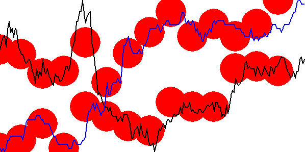
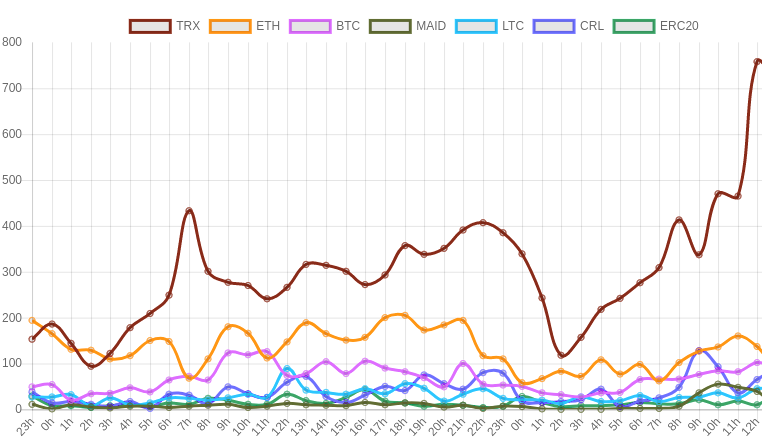

# Cryptocurrency Bot
## Let's be rich

This project is about making a trader-bot from scratch, I will use these technology :
 - C : because I will have to work effectively with many GB of data.
 - Python : because python is good for AI and work great with C
 - Javascript/Canvas : Because I want to always have graphicals views of what I'me currently doing, and what is better than web to make user-interfaces

 I have actually no clue how it will work, but I start it anyway, that's the spirit.

 ## Feed The Bot:
 I want my bot to do microtrading, like buy now and sell 10 minutes later, I need to feed it with a "situation", this is the detail of a situation : 
  - The actual Price of an altcoin now
  - The historical Price of this altcoin from 200 minute ago from now

Now the challenge is to ask the bot : "can you parse all the historical data I gave you and find another situation wich look like this one ?"  
if the bot find one or many, it will tell regarding of the founds situation what happened next, so what might append to our situation. This is a very naive way to approach the project, but I need to start somewhere.

### How a situation can look like another situation ? 
Well, I will certainly not find an exact similare situation with exacts percentage of change over 200 minutes of prices.  
Let's try an approach : 
The more the time is far from now, the more percentage of change can differ.  
An gif will be more comprehensible : 

  

 - In black there is our 200 points wich define a situation.  
 - In red, the tolerance.

So a valid situation should always be between the to red lines to be "similar" to the black one.  

Here an example of situation "matching" another with bubble-match™ this time

  

## I need more data

I get prices data every minutes from 2000 differents altcoins and I stock it into a mysql database.  
Prices aren't the only information a bot can use, for example, the amount of time a currency is mentionned on tweeter seem to be a usefull information.  
Lets use the Twitter API to get and save in real time every tweets that's mention the keywords : 
 - blockchain
 - cryptocurrency
 - altcoin
 - #ICO

 With those, I save more than 300K tweets per day, lets see the most redundant cited currency from last days: 

 

 Seem's like peoples are talking about TRX today that's interesting.
 You can see this chart updated every hours here : 
 http://dezmou.tk/graph.html
